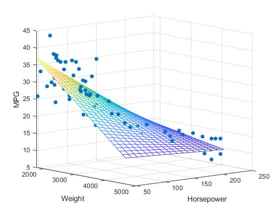

```{r include=FALSE}
library(tidyverse)
library(countdown)

salary <- readxl::read_xlsx("data/salary.xlsx")

knitr::opts_chunk$set(message = FALSE, warning = FALSE, fig.width = 12, fig.height = 6)
```

# Regression - history

- method of least squares (Legendre 1805, Gauss 1809)

- term "regression" - Francis Galton in the nineteenth century

- before 1970, it sometimes took up to 24 hours to receive the result from one regression

[Wikipedia 2021](https://en.wikipedia.org/wiki/Regression_analysis)

---

# Regression

Statistical process for estimate the relationships between variables. 

Aims of regression analysis:

- discover causal relationships,

- prediction and forecasting.

The regression model is only an approximation of reality!

---

# Simple regression

Analysis of two variables

- dependent (outcome) variable denoted as $y$

- independent (predictors, covariates, features) variable denoted as $x$

Examples: 

- dependency between sales and spendings on advertisement 

- dependency between salary and experience

---

# Example

Dataset [salary](http://www.wawrowski.edu.pl/data/salary.xlsx) contains information about annual salary (in \$) and years experience.

---

# Scatter plot

```{r echo=FALSE}
plot(salary)
```

---

class: inverse

# Excercise

Create a scatter plot for `salary` dataset with _ggplot2_ package. 

`r countdown(minutes = 5, seconds = 0, top = 0)`

---

# Scatter plot

```{r echo=FALSE}

ggplot(salary, aes(x = YearsExperience, y = Salary)) + 
  geom_point() +
  geom_smooth(method = "lm", se = FALSE)

```

---

# Simple regression

General form of simple regression:

$$\hat{y}_{i}=\beta_{1}x_{i}+\beta_{0}$$

where $\hat{y}$ is theoretical (predicted) value from model. 

Therefore empirical (true) values $y$ are described by formula:

$$y_{i}=\beta_{1}x_{i}+\beta_{0}+e_{i}$$

where $e_i$ is residual calculated as $e_{i}=y_{i}-\hat{y}_{i}$. 

---

# Simple regression in R

```{r eval=FALSE}
lm(formula = dependent_var ~ independent_var, data = dataset)
```

- `formula` - description of model with tilde

- `data` - data frame with data

Function `lm` returns only $\beta$ coefficients as default. 

To obtain detailed information about model `summary()` function must be used.

```{r eval=FALSE}
model <- lm(formula = dependent_var ~ independent_var, data = dataset)
summary(model)
```

---

# $\beta$ coefficients

A slope $\beta_1$ indicates how much the average value of the dependent variable (y) will change when the value of the independent variable (x) increases by a unit. In other words: as the value of the x variable increases by 1 the value of the y increases by a slope. 

The intercept $\beta_0$ is the value of the dependent variable (y), if the value of the independent variable (x) is 0. Special care should be taken when interpreting this coefficient, because it is often meaningless. If x variable never is equal to 0, there is no interest in the intercept.

---

# Regression assessment

Measure that describes fitting the regression function to the empirical data is the **standard error of the regression**

$$S_{e}=\sqrt{\frac{\sum\limits_{i=1}^{n}{(y_{i}-\hat{y}_{i})^2}}{n-2}}$$

The standard error of the regression represents the average distance that the observed values fall from the regression line. Conveniently, it tells you how wrong the regression model is on average using the units of the dependent variable. Smaller values are better because it indicates that the observations are closer to the fitted line.

---

# Regression assessment

An equally important measure of fitting the regression function to the empirical data is the **coefficient of determination** or more commonly, the **R- squared**. The definition of R-squared is fairly straight-forward; it is the percentage of the dependent variable variation that is explained by a linear model.

$$R^2=1-\frac{\sum\limits_{i=1}^{n}{(y_{i}-\hat{y}_{i})^2}}{\sum\limits_{i=1}^{n}{(y_{i}-\bar{y}_{i})^2}}$$

It determines what percentage of variable variance is explained by the regression function. $R^2$ takes values from $<0;1>$ or $<0\%;100\%>$. In general, the higher the R-squared, the better the model fits your data.

---

# Wald test

- significance of each $\beta$ coefficient

- significance of $\beta$ vector coefficients

---

# Prediction

To predict with created model we need to import or create a dataset with $x$ values.

```{r eval=FALSE}
new_exp <- data.frame(x=c(5,7,9))

predict(object = model, newdata = new_exp)
```

---

class: inverse

# Excercise 

Create a simple regression model for dependency between sales and number of clients in [Rossmann store](data/store77.xlsx).

1. What is the $R^2$ of this model?

2. What is forecasting sales for 300, 7000 and 1050 clients?

`r countdown(minutes = 10, seconds = 0, top = 0)`

```{r eval=FALSE, include=FALSE}
store77 <- readxl::read_xlsx("data/store77.xlsx")

model <- lm(sales ~ no_clients, store77)

summary(model)

```

---

<iframe src="https://embed.polleverywhere.com/multiple_choice_polls/rhJUGX0vYgvlBgZvfslap?controls=none&short_poll=true" width="100%" height="100%"></iframe>

---

# Multiple regression

General form of multiple regression:

$$\hat{y}_{i}=\beta_{1}x_{1i}+\beta_{2}x_{2i}+...+\beta_{k}x_{ki}+\beta_{0}$$

In this case we are not looking for straight line but $k$-dimensional space.

---

# Regression of three variables



---

# Example

Based on dataset [employees](data/employees.xlsx) create a model for variable current wage.

- id - identifier of employee
- gender (0 - male, 1 - woman)
- birth_date - date of birth
- education - years of education
- employee_category (1 - specialist, 2 - manager, 3 - consultant)
- **current_salary**
- starting_salary
- experience (in months)
- former_employment (in months)
- unions - membership of unions (0 - no, 1 - yes)
- age (w years)

---

class: inverse

# Excercise

Based on employee dataset create a new one without missing data and only with necessary variables.

`r countdown(minutes = 5, seconds = 0, top = 0)`

---

# Dichotomization of a variable

Converting a quantitative variable containing $k$ variants to $k-1$ zero-one variables.

.pull-left[

Original dataset

| id | position |
|----|------------|
| 1  | specialist |
| 2  | manager    |
| 3  | specialist |
| 4  | consultant |
| 5  | consultant |

]

.pull-right[
Zero-one variable

| id | manager | consultant |
|----|----------|------------|
| 1  | 0 | 0 |
| 2  | 1 | 0 |
| 3  | 0 | 0 |
| 4  | 0 | 1 |
| 5  | 0 | 1 |

]

---

# Dichotomization of a variable

The $\beta$ coefficient for a dichotomous variable shows how much the average will change in the value of the dependent variable $y$ with respect to the reference (base) category of the $x$ variable.

For example, assuming the position of _specialist_ as the base category, the $\beta$ coefficient for the _manager_ category will inform you how much on average the value of current salary is higher or lower than _specialist_.

---

# Collinearity diagnostics

[corrplot](https://cran.r-project.org/web/packages/corrplot/) package can be used to analyze and visualize coefficient of correlation.

The correlation coefficient shows the strength and direction of the relationship between two quantitative variables. It is a normalized value and it takes values from the interval $r\in<-1;1>$.

- $r_{xy}=1$ - perfect positive correlation,

- $0<r_{xy}<1$ - weak/moderate/strong positive correlation,

- $r_{xy}=0$ - no correlation,

- $-1<r_{xy}<0$ - weak/moderate/strong negative correlation,

- $r_{xy}=-1$ - perfect negative correlation.

---

# Model diagnostics

[olsrr](https://cran.r-project.org/web/packages/olsrr/) package contains functions for linear models.

- model selection

- collinearity diagnostics

- normality assessment

- outlier detection

There are also packages for other methods at [rsquared academy](https://pkgs.rsquaredacademy.com/).

---

# Model selection

There are three approaches to model selection:

- expert selection

- analysis of all possible models $2^p-1$

```r
ols_step_all_possible(model)
```

- stepwise regression

```r
ols_step_both_aic(model)

```

---

# Collinearity diagnostics

```r
ols_vif_tol(model)
```

**Tolerance** percent of variance in the predictor that cannot be accounted for by other predictors.

**Variance Inflation Factor** measures the inflation in the variances of the parameter estimates due to collinearities that exist among the predictors. The general rule is that VIFs exceeding 4 warrant further investigation, while VIFs exceeding 10 are signs of serious multicollinearity requiring correction. VIF is calculated as 1/Tolerance

---

# Normality assessment

Multiple regression assumes that the residuals are normally distributed.

- histogram

```r
ols_plot_resid_hist(model)
```

- normality tests

```r
ols_test_normality(model)
```

- quantile-quantile plots

```r
ols_plot_resid_qq(model)
```

---

# Outliers detection

- Cook Distance - threshold calculated as $4/n$

```r
ols_plot_cooksd_bar(model)
```

- Studentized residual - threshold is 3 (in absolute value)

```r
ols_plot_resid_stud(model)
```

- Studentized residual - threshold is 2 (in absolute value)

```r
ols_plot_resid_stud_fit(model)
```

---

class: inverse

# Exercise

Base on [50 startups](http://www.wawrowski.edu.pl/data/startups.xlsx) dataset create the best possible model. 

Use _janitor_ package and `clean_names()` function to clean variable names.

`r countdown(minutes = 10, seconds = 0, top = 0)`

---

class: inverse, center, middle

# Questions?