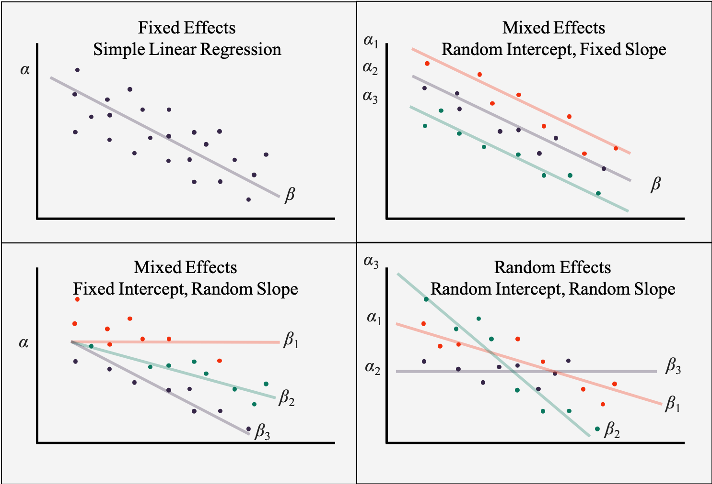

```{r include=FALSE}
library(tidyverse)
library(countdown)
options(scipen=100)
```

# Introduction

> Statisticians are probably the only specialists who not only proudly state that their answers are most likely to be error-prone, but also make every effort to precisely define the size of the error.

Bruce Frey, _Statistics hacks_

---

# Random sample

1. Define aim of survey

2. Define target population 

3. Obtain a sample from population with sample design

4. Collect data

---

# Direct estimation

An "estimator" is a statistic (that is, a function of the data) that is used to infer the value of an unknown parameter in a statistical model [Wikipedia 2020](https://en.wikipedia.org/wiki/Estimator).

**Horvitz-Thompson estimator**

$$\hat{\bar{\theta}}^{HT}=\frac{1}{\hat{N}}\sum\limits_{i=1}^{n}{y_iw_i}$$

where:

- $\hat{N}$ - population size,
- $n$ - sample size,
- $y_i$ - target variable for $i$-th unit,
- $w_i$ - weight for $i$-th unit.

---

# Direct estimation

Variance of Horvitz-Thompson estimator:

$$V(\hat{\bar{\theta}}^{HT})=\frac{N-n}{N} \cdot \frac{s^2_y}{n}$$

where:

- $N$ - population size,
- $n$ - sample size,
- $s^2_y$ - variance of target variable $y$.

---

# Direct estimation

Standard error of estimator:

$$\text{SE}=\sqrt{V(\hat{\theta}^{HT})}$$

--

Relative standard error of estimator:

$$\text{CV}=\frac{\text{SE}}{\hat{\theta}^{HT}}$$

Given as a percentage and according to Statistics Poland standards, it should not exceed 10%.

---

# Problem

Most of the surveys conducted by the Statistics Poland belong to the group of sample (representative) surveys, i.e. those in which only a small part of the population is analyzed. Thanks to the use of appropriate procedures and mathematical methods, it is possible to infer about the population solely on the basis of the collected sample. In such a situation, in addition to the estimated value, the error of this estimate is also given. It is assumed that the smaller the sample, the greater the estimation error.

Detailed sections are not published on the basis of a sample due to high errors in these estimates. For example, the poverty rate is published only by 6 regions (based on EU-SILC).

If the value of the relative estimation error is higher than the adopted criterion, the methods of small area estimation (indirect estimation) can be used, which use auxiliary variables to improve the precision of estimates.

The term _small area estimation_ does not only refer to small territorial areas, but above all to sections (groups) in which the sample size does not allow for obtaining precise estimates.

---

# Main applications

- [labour market](https://journals.sagepub.com/doi/abs/10.1177/1471082X13478873)
- [poverty](https://onlinelibrary.wiley.com/doi/abs/10.1002/cjs.10051)
- [disability](https://ps.stat.gov.pl/Article/2018/4/449-472)
- [medicine](https://cebp.aacrjournals.org/content/27/3/245.abstract)
- [agriculture](http://isas.org.in/jsp/volume/vol57/issueSV/jnkrao.pdf)
- [business statistics](https://onlinelibrary.wiley.com/doi/abs/10.1111/sjos.12205)
- [crimes](https://academic.oup.com/bjc/advance-article-abstract/doi/10.1093/bjc/azaa067/5924614)
- [Big Data - twitter](https://content.sciendo.com/configurable/contentpage/journals$002fjos$002f36$002f2$002farticle-p315.xml)
- [municipal solid waste](https://www.sciencedirect.com/science/article/pii/S0198971517305859)

[Recent publications](https://scholar.google.pl/scholar?as_ylo=2019&q=small+area+estimation&hl=pl&as_sdt=0,5)

---

# Small area estimation approaches

**area-level**

The level of the dependent variable in a given area is explained with variables measured at the level of this area. For this purpose, socio-economic characteristics available, e.g. in public statistical databases, such as the Local Data Bank.

**unit-level**

It is based on modeling continuous or binary variables using unit data from a sample survey, and then running a Monte Carlo simulation using data from a census or administrative register.

---

# Excercise

Improve the quality of estimating the unemployment rate at the level of poviats - data set `unemployment_rate.rda`.

- `y_ht` - direct estimation of unemployment rate

- `y_ht_se` - standard error of unemployment rate estimate

- `y_ht_cv` - relative standard error of unemployment rate estimate

- `y_ht_var` - variance of unemployment rate estimate

--

What is the average value of the relative error of unemployment rate estimates?

---

<iframe src="https://embed.polleverywhere.com/multiple_choice_polls/O3MnbVekTzTWjfUBRCWHv?controls=none&short_poll=true" width="100%" height="100%"></iframe>

---

# Linear mixed model

Model with fixed effects

$$y = x'\beta + e$$

Model with fixed and random effects

$$y = x'\beta + u + e$$

---

# Linear mixed model



[źródło](https://bookdown.org/steve_midway/BHME/Ch5.html)

---

# Fay-Herriot model (1979)

The direct estimate of $\hat{\theta}^{HT}_d$ for $\theta_d$ is assumed to be unbiased and can be written as:

$$\hat{\theta}^{HT}_d = \theta_d + e_d$$

where $e_d\stackrel{ind}{\sim} N(0,\psi_{d})$. In practice, the variance of $\psi_d$ is unknown and is therefore estimated on the basis of a sample.

In the second step, the Fay-Herriot (FH) model treats $ \theta_d$ as the dependent variable in the linear model with one random effect at the area level:

$$\theta_d=x_d'\beta+u_d$$

where $x_d$ - vector of explanatory variables for the $d$ area with dimensions $p \times 1$, $\beta$ - vector of regression parameters and $u_d$ - area effect $u_d\stackrel{iid}{\sim}N(0,\sigma^2_u)$.

Therefore, the Fay-Herriot model is a variant of the linear model with a diagonal covariance structure:

$$\hat{\theta}^{HT}_d=x_d'\beta+u_d+e_d$$

---

# Estimator of FH model

The model's estimator is the weighted mean of the direct estimate $\hat{\theta}_{d}^{HT}$ and the synthetic regression estimate $x_d^{T}\hat{\beta}$. The weight $\gamma_d \in \left\langle 0,1\right\rangle$ measures the uncertainty resulting from the description of the estimated value by the regression model. Depending on the variance from the $\psi_d$ sample and the area variance $\sigma_u^2$, a greater or lesser share will be assigned to the direct estimate.

$$\hat{\theta}_{d}^{FH}=x_d^{T}\hat{\beta} + \hat{u}_d = \hat{\gamma}_d\hat{\theta}_{d}^{HT} + (1-\hat{\gamma}_d)x_d^{T}\hat{\beta},\; d=1, ..., D,$$

where: $\hat{\gamma}_d=\frac{\hat{\sigma}^2_u}{\hat{\sigma}^2_u+\psi_d}$, and $\hat{\beta}$ is determined using the weighted least squares method.

When using model-based methods, it is important to ensure that the assumptions are met. In the case of the Fay-Herriot model, this is an assumption about the normality of random effects $\hat{u}_d=\hat{\gamma}_d(\hat{\theta}_{d}^{HT}-x_d^{T}\hat{\beta})$ and residuals $r=\hat{\theta}_{d}^{HT}-x_d^{T}\hat{\beta}$.

---

# emdi package

**Estimating and Mapping Disaggregated Indicators**

[The R Package emdi for Estimating and Mapping Regionally Disaggregated Indicators](https://cran.r-project.org/web/packages/emdi/vignettes/vignette_emdi.pdf)

[A Framework for Producing Small Area Estimates Based on Area-Level Models in R](https://cran.r-project.org/web/packages/emdi/vignettes/vignette_fh.pdf)

```r
fh(fixed, vardir, combined_data, domains, MSE)
```

- `fixed` - model description `y ~ x1 + x2 + x3`

- `vardir` - name of column with variances

- `combined_data` - data set

- `domains` - name of column with domains

- `MSE` - should standard error be calculated `TRUE/FALSE`

---

# Excercise

As auxiliary variables we will use:

- $x_1$ - non-working age population per 100 working age population
- $x_2$ - share of population using community social assistance

We will fit the linear regression model first, followed by the Fay-Herriot model.

---

# Excercise

What is the average value of relative error of the estimates obtained from the Fay-Herriot model?

---

<iframe src="https://embed.polleverywhere.com/multiple_choice_polls/xw6FIUzN7l856rv5Ni5TZ?controls=none&short_poll=true" width="100%" height="100%"></iframe>

---

<iframe src="https://embed.polleverywhere.com/multiple_choice_polls/yYN2GAayjsGtR6yJkWCJS?controls=none&short_poll=true" width="100%" height="100%"></iframe>

---

<iframe src="https://embed.polleverywhere.com/multiple_choice_polls/l8WvpIBjPgX1FoCEyC7Jd?controls=none&short_poll=true" width="100%" height="100%"></iframe>
---

class: center, middle, inverse

# Questions?

