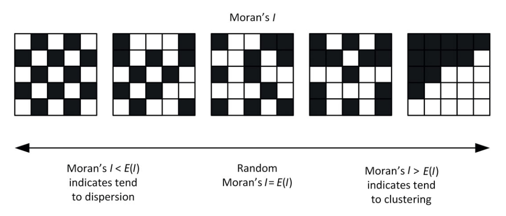

```{r include=FALSE}
knitr::opts_chunk$set(message = F, warning = F)

library(tidyverse)
library(countdown)
options(scipen=100)
```

# Introduction

[Geocomputation with R](https://geocompr.robinlovelace.net/)

[CRAN Task View: Analysis of Spatial Data](https://cran.r-project.org/web/views/Spatial.html)

[Ekonometria i statystyka przestrzenna z wykorzystaniem program R CRAN](https://cedewu.pl/Ekonometria-i-statystyka-przestrzenna-z-wykorzystaniem-program-R-CRAN-CD-wyd-II-p225)

[Search and Retrieve Spatial Data from 'GUGiK'](https://cran.r-project.org/web/packages/rgugik/index.html)

[Data about boundaries in Poland](http://www.gugik.gov.pl/pzgik/dane-bez-oplat/dane-z-panstwowego-rejestru-granic-i-powierzchni-jednostek-podzialow-terytorialnych-kraju-prg)

---

# TERYT code - Poznań commune

full TERYT: `023016264011`

simple TERYT: `3004011`

- `02` - macroregion id (6)

- `30` - voivodeship id (16)

- `1` - region id (2 - masovian region , 1 - the rest of country)

- `62` - subregion id (73)

- `64` - county id (380)

- `01` - commune id (2477)

- `1` - type of commune

---

# sf package

[sf: Simple Features for R](https://cran.r-project.org/web/packages/sf/index.html)

.pull-left[

```{r eval=FALSE}
library(rgugik)
library(sf)

voivodeship <- voivodeship_names

voivodeship_geom <- borders_get(TERYT = voivodeship$TERC)

plot(voivodeship_geom)

```

]

.pull-right[

```{r echo=FALSE}
library(rgugik)
library(sf)

voivodeship <- voivodeship_names

voivodeship_geom <- borders_get(TERYT = voivodeship$TERC)

plot(voivodeship_geom)

```

]

---

# sf + ggplot

.pull-left[

```{r eval=FALSE}
library(tidyverse)
library(ggthemes)

ggplot(voivodeship_geom, aes(geometry = geometry)) + 
  geom_sf() + 
  theme_map()
```

]

.pull-right[

```{r echo=FALSE}
library(tidyverse)
library(ggthemes)

ggplot(voivodeship_geom, aes(geometry = geometry)) + 
  geom_sf() + 
  theme_map()
```

]

---

# Spatial data at counties level

Do NOT run - it takes few minutes to download data.

```{r eval=FALSE}
library(rgugik)

counties <- county_names

counties_geom <- borders_get(TERYT = counties$TERYT)

save(counties_geom, file = "data/counties_geom.rda")

```

Download `counties_geom.rda` from moodle.


---

# Data

`data_counties.xlsx`

- TERYT

- population

- number_500plus - number of children in 500+ programme

- unemployment_rate

- unemployment_rate100 - relative unemployment rate (Poland = 100%)

- average_salary

- average_salary100 - relative average salary (Poland = 100%)

- capital_distance - distance to capital of voivodeship

---

# spdep package

[spdep: Spatial Dependence: Weighting Schemes, Statistics](https://cran.r-project.org/web/packages/spdep/index.html)

Neighbors list and matrix

- `poly2nb` - creates a neighbors list based on polygon list

- `nb2listw` - calculates spatial weights for neighbors lists

- `nb2mat` - calculates spatial weights matrix for neighbors lists

Spatial autocorrelation measures

- `moran` - Moran's I statistic

- `geary` - Geary's C statistic

---

# Moran I

$$I=\frac{\sum_i\sum_j w_{ij}(x_i-\bar{x})(x_j-\bar{x})}{\frac{1}{n}\sum_i (x_j-\bar{x})^2\sum_i\sum_j w_{ij}}$$

where:

- $x_i$ is value in region $i$, 
- $\bar{x}$ is average in all regions, 
- $n$ - number of regions, 
- $w_{ij}$ - element of spatial weights from neighbor matrix.

---

# Moran I



[Źródło](https://www.cambridge.org/core/books/spatial-analysis-methods-and-practice/spatial-autocorrelation/F6A01B574C69076F28318445C33397E4)

---

# Moran plot

Spatial lag - a weighted sum of the values observed at neighboring locations, since the non-neighbors are not included.

Dependency between region and neighbors

|     | Low values in neighbors | High values in neighbors |
|-----|-------------------------|--------------------------|
|High value in region | Negative spatial autocorrelation | Positive spatial autocorrelation |
|Low value in region | Positive spatial autocorrelation | Negative spatial autocorrelation |

---

# spatialreg package

[spatialreg: Spatial Regression Analysis](https://cran.r-project.org/web/packages/spatialreg/index.html)

Spatial models

- `lagsarlm` - spatial autoregressive lag model

- `errorsarlm` - spatial autoregressive error model

---

# Spatial autoregressive lag model

$$y = \rho Wy + X\beta + e$$

where:

- $\rho$ - spatial autocorrelation coefficient,
- $Wy$ - spatial lagged dependent variable,
- $X$ - covariates matrix,
- $\beta$ - vector of regression coefficients,
- $e$ - random error.

---

# Spatial autoregressive error model

$$y = X\beta + e$$
$$e=\lambda We+\xi$$

where:

- $\lambda$ - spatial autocorrelation coefficient,
- $We$ - spatial lagged residual,
- $X$ - covariates matrix,
- $\beta$ - vector of regression coefficients,
- $\xi$ - random error.

---

# Models assesment

- AIC

- Moran test

---

class: center, middle, inverse

# Questions?

