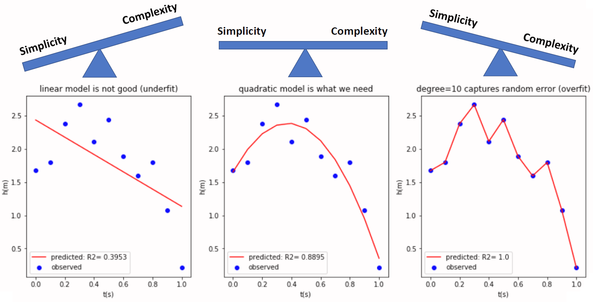

```{r include=FALSE}
library(tidyverse)
library(countdown)

knitr::opts_chunk$set(message = FALSE, warning = FALSE, fig.width = 12, fig.height = 6)
```

# Regression in machine learning

Supervised learning algorithms build a mathematical model of a set of data that contains both the inputs and the desired outputs.

---

# Hotel booking demand dataset

[Kaggle page](https://www.kaggle.com/jessemostipak/hotel-booking-demand)

119390 observations and 32 variables

Problem: predict Average Daily Rate

[The average daily rate is calculated by taking the average revenue earned from rooms and dividing it by the number of rooms sold.](https://www.investopedia.com/terms/a/average-daily-rate.asp)

[Source](https://www.sciencedirect.com/science/article/pii/S2352340918315191)

---

# Data partition

- training dataset - a dataset of examples used during the learning process and is used to fit the parameters 

- test dataset - a dataset that is independent of the training dataset, but that follows the same probability distribution as the training dataset

- validation dataset - a dataset of examples used to tune the hyperparameters

The terms test set and validation set are sometimes used in a way that flips their meaning in both industry and academia.

[Wikipedia](https://en.wikipedia.org/wiki/Training%2C_validation%2C_and_test_sets)

[rsample](https://cran.r-project.org/web/packages/rsample/index.html) package contains functions to data partition.

---

# Algorithms

- regression: many assumptions

- decision trees: easy interpretation

- non-parametric methods: not efective for large datasets

- black-box models: neural networks, boosting

---

# Model complexity


---

# Model complexity



---

# ML frameworks

There are 96 packages for ML in R - [Machine Learning Task View](https://cran.r-project.org/web/views/MachineLearning.html). They can be used individually but are not standardized in any way: different argument names and result object structures.

Packages designed to integrate different algorithms:

- [caret](https://topepo.github.io/caret/)

- [mlr3](https://mlr3.mlr-org.com/)

- [h2o](https://docs.h2o.ai/h2o/latest-stable/h2o-docs/welcome.html)

---

# Assesment measures 

- RMSE (root mean square error)

$$RMSE = \sqrt{\frac{1}{n}\sum(y_i - \hat{y}_i)^2}$$

- R-square

$$R^2 = 1-\frac{\sum(y_i - \hat{y}_i)^2}{\sum(y_i - \bar{y}_i)^2}$$

- MAE (mean absolute error)

$$MAE = \frac{1}{n}\sum|y_i - \hat{y}_i|$$

---

# h2o package

H2O is an open source, in-memory, distributed, fast, and scalable machine learning and predictive analytics platform that allows you to build machine learning models on big data and provides easy productionalization of those models in an enterprise environment.

- many algorithms

- builded-in Explainable AI (XAI) (patrz też: [DrWhy](https://github.com/ModelOriented/DrWhy/blob/master/README.md))

- GUI `h2o.flow()`

- automatic model selection `h2o.automl()` - [webinar](https://www.youtube.com/watch?v=DjzKTeIIxOY&t=2978s)

---

# Cross validation


[Source](https://ubc-dsci.github.io/introduction-to-datascience/)

---

# Hyperparameters tuning

The default model parameters are not necessarily the best. Parameter searching methods are used to improve the classifier.

- learning rate

- max depth

- number of trees

- sample rate

You can search the entire parameter space (computationally intensive) or randomly.

---

# h2o code

```r
gbm_params <- list(learn_rate = seq(0.01, 0.1, 0.01),
                   max_depth = seq(2, 10, 1),
                   sample_rate = seq(0.5, 1.0, 0.1),
                   col_sample_rate = seq(0.1, 1.0, 0.1),
                   ntrees = seq(50,150,10))

search_criteria <- list(strategy = "RandomDiscrete", max_models = 36, seed = 1)

gbm_grid <- h2o.grid(algorithm = "gbm", 
                     x = x_vars, 
                     y = y_var,
                     grid_id = "gbm_grid",
                     training_frame = booking_train_h2o,
                     validation_frame = booking_test_h2o,
                     seed = 1,
                     hyper_params = gbm_params,
                     search_criteria = search_criteria)

gbm_gridperf <- h2o.getGrid(grid_id = "gbm_grid",
                            sort_by = "mse",
                            decreasing = FALSE)

best_gbm <- h2o.getModel(gbm_gridperf@model_ids[[1]])
```

---

# Model explaination

- The features importance - how much the model uses a given feature for prediction.

- Partial dependency plots - how the prediction changes depending on the predictor.

[Explanatory Model Analysis](https://pbiecek.github.io/ema/)

[Interpretable Machine Learning](https://christophm.github.io/interpretable-ml-book/)

---

class: inverse, center, middle

# Questions?